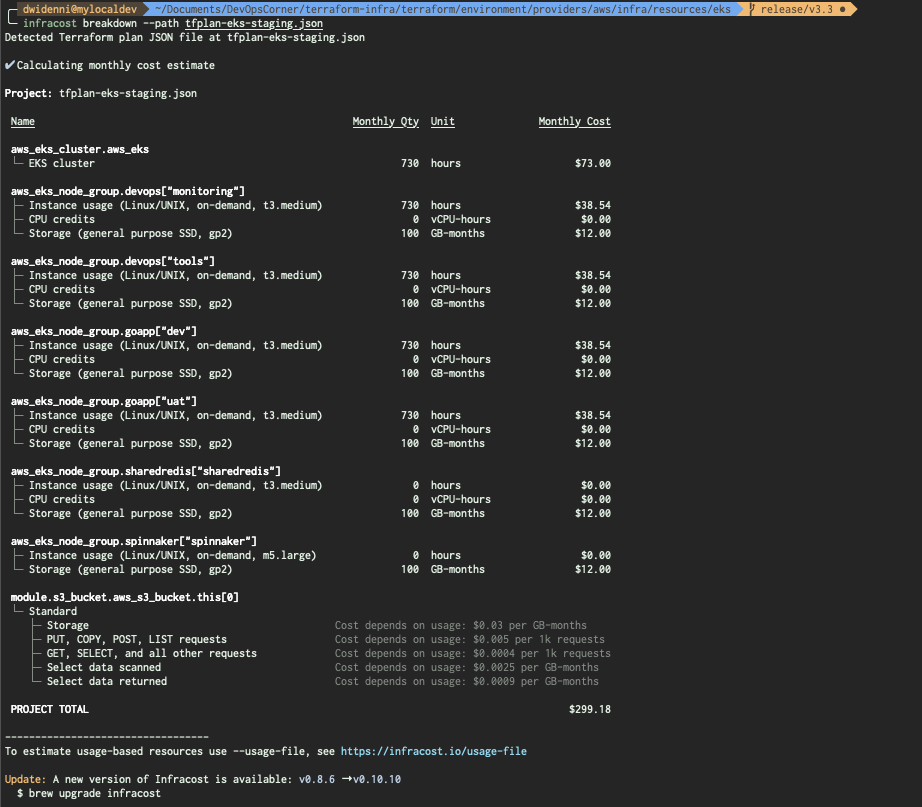

# Terraform Infra Costing Review

## From `buildspec-terraform-infracost-eks.yml`

### Running Terraform Plan

```bash
# ========================= #
#  Terraform Plan (Review)  #
# ========================= #
- terraform init
- terraform workspace select ${WORKSPACE_ENV} || terraform workspace new ${WORKSPACE_ENV}
- terraform plan --out tfplan-eks-staging.binary
- terraform show -json tfplan-eks-staging.binary > tfplan-eks-staging.json
```

### Running Infra Costing from `tfplan-eks-staging.json`

```bash
# ===================== #
#  Terraform Infracost  #
# ===================== #
# ~ Infracost
- infracost breakdown --path tfplan-eks-staging.json
```


