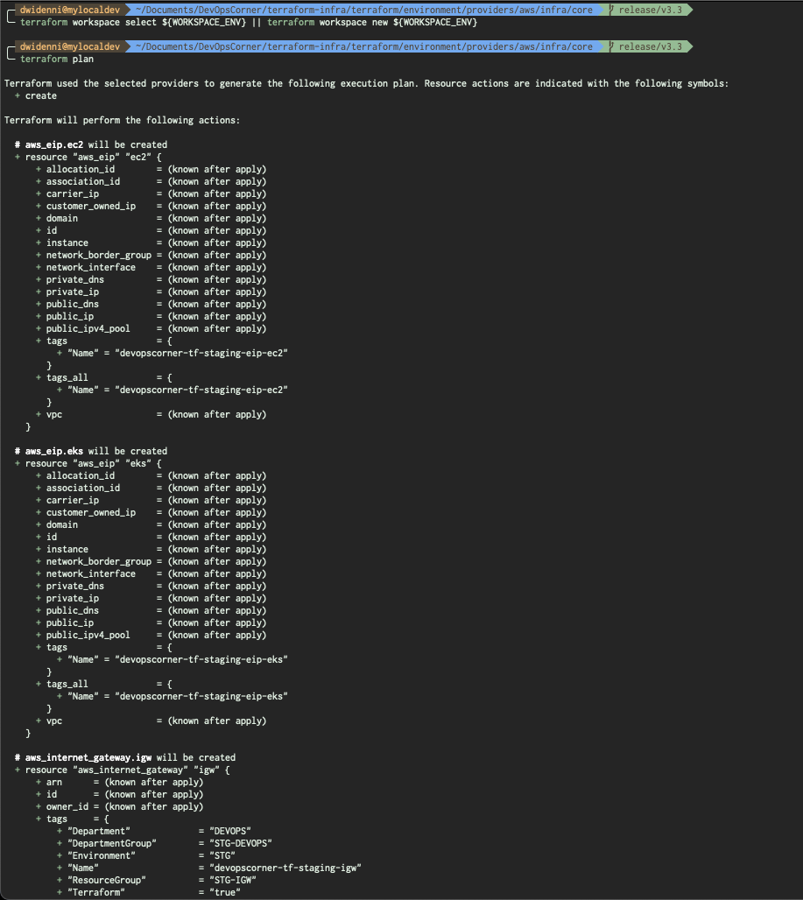
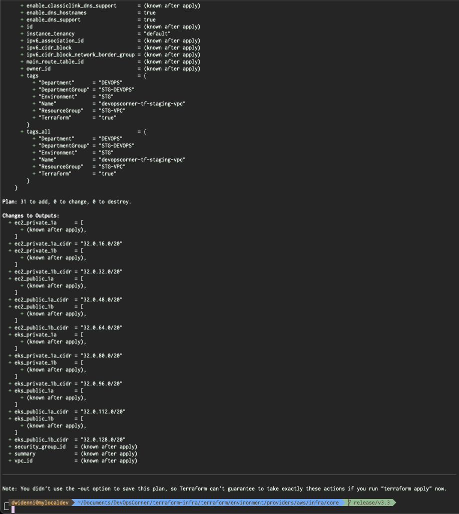

## From `buildspec-terraform-core-plan.yml`

### Running Terraform Plan

```bash
# ========================= #
#  Terraform Plan (Review)  #
# ========================= #
- terraform init
- terraform workspace select ${WORKSPACE_ENV} || terraform workspace new ${WORKSPACE_ENV}
- terraform plan --out tfplan-core-staging.binary
- terraform show -json tfplan-core-staging.binary > tfplan-core-staging.json
```




### Results

```json
--- PUT JSON OUTPUT HERE ---
```
