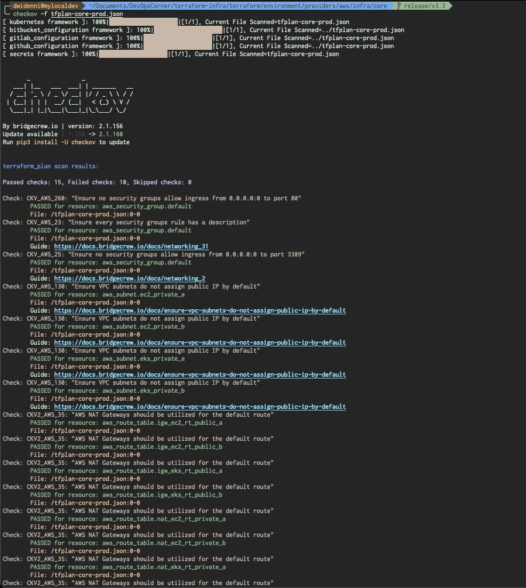
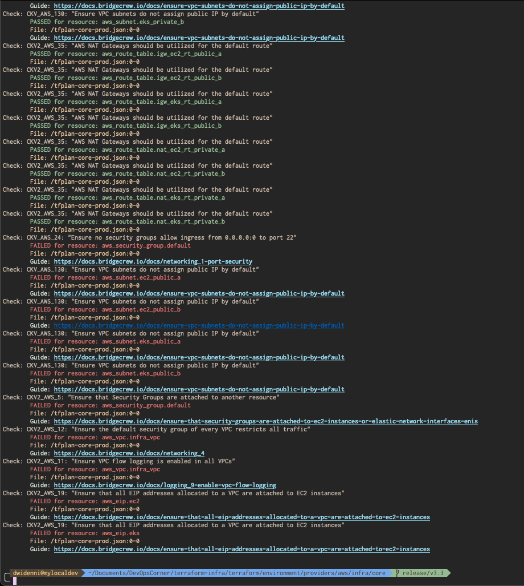
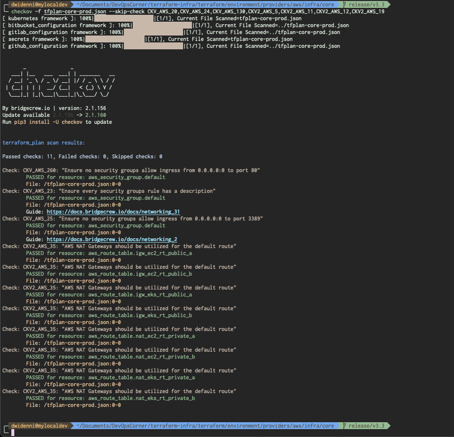
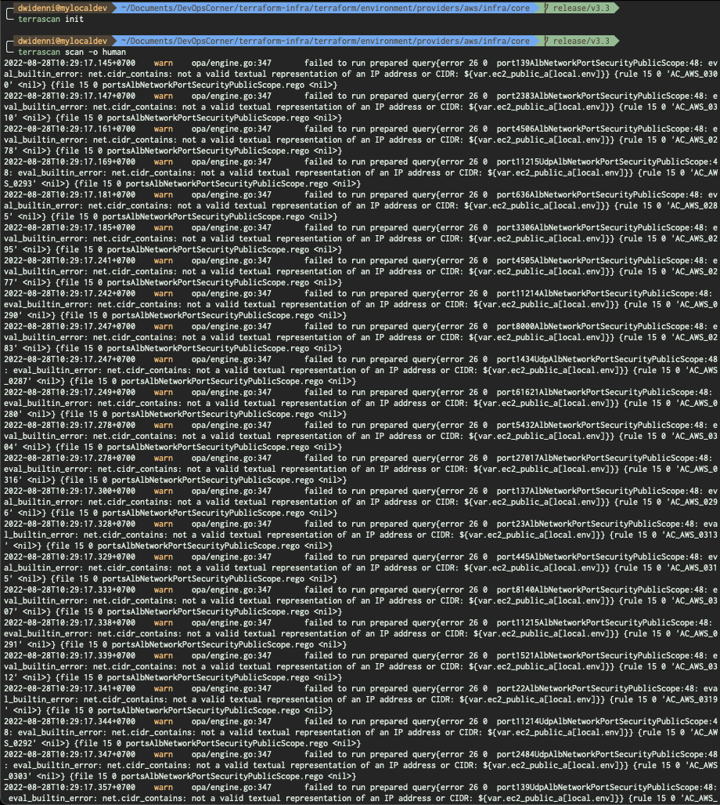
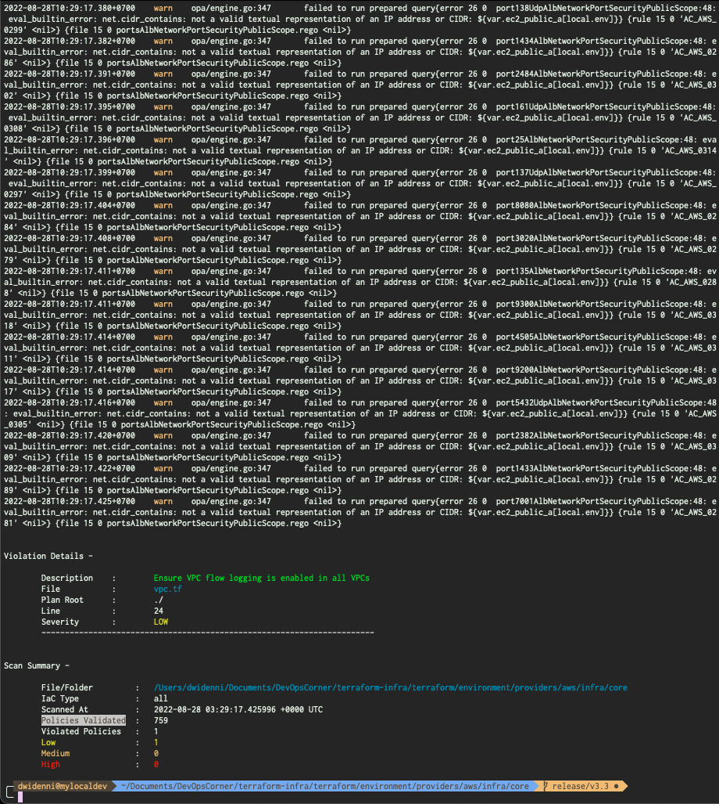
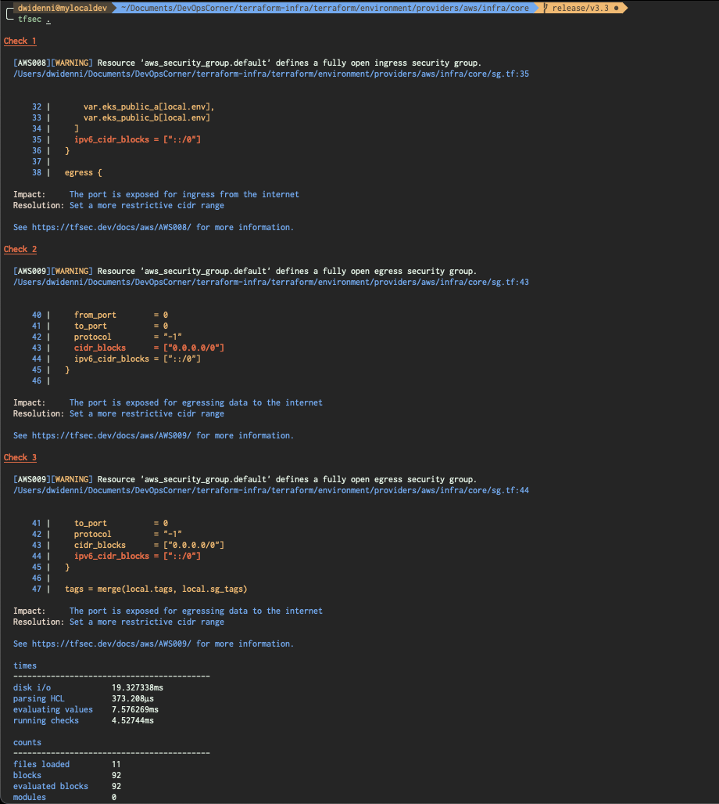
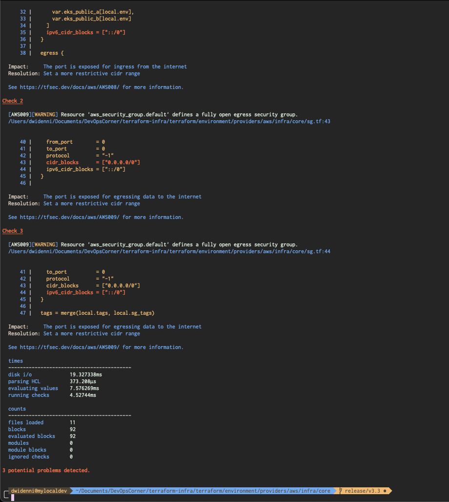

# Security Analysis for Terraform Plan

## From `buildspec-terraform-scan.yml`

### Running Terraform Plan

```bash
# ========================= #
#  Terraform Plan (Review)  #
# ========================= #
- terraform init
- terraform workspace select ${WORKSPACE_ENV} || terraform workspace new ${WORKSPACE_ENV}
- terraform plan --out tfplan-core-prod.binary
- terraform show -json tfplan-core-prod.binary > tfplan-core-prod.json
```

### Running Checkov from `tfplan-core-prod.json`

```bash
# =================== #
#  Terraform Checkov  #
# =================== #
# ~ Checkov
- checkov -f tfplan-core-prod.json
```

### Terraform Scan




### Terraform Scan Skip Policy

```bash
# =================== #
#  Terraform Checkov  #
# =================== #
# Skip scan policies
# Refences: https://www.checkov.io/5.Policy%20Index/all.html
- checkov -f tfplan-core-prod.json --skip-check CKV_AWS_20,CKV_AWS_24,CKV_AWS_130,CKV2_AWS_5,CKV2_AWS_11,CKV2_AWS_12,CKV2_AWS_19
```



### Running Alternative Checkov from `tfplan-core-prod.json`

```bash
# ===================== #
#  Terraform Terrascan  #
# ===================== #
# ~ Terrascan ~
- terrascan init
- terrascan scan -o human
```




```bash
# ================== #
#  Terraform TFSec   #
# ================== #
# ~ Tfsec ~
- tfsec .
```



